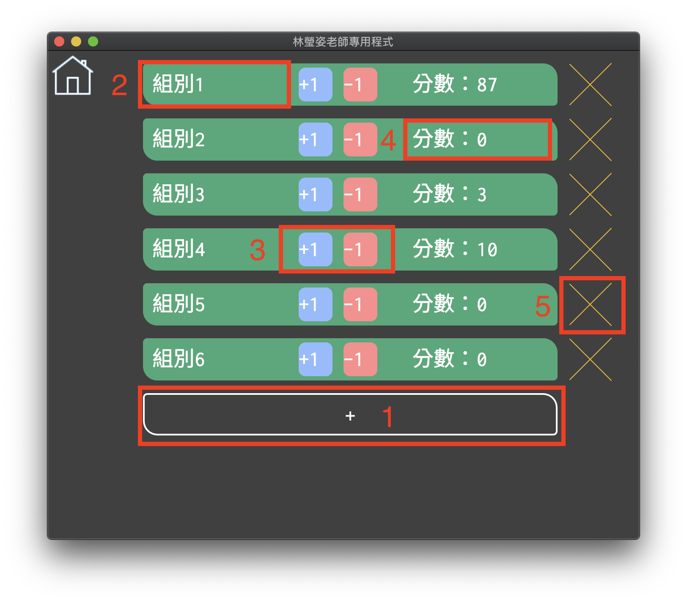
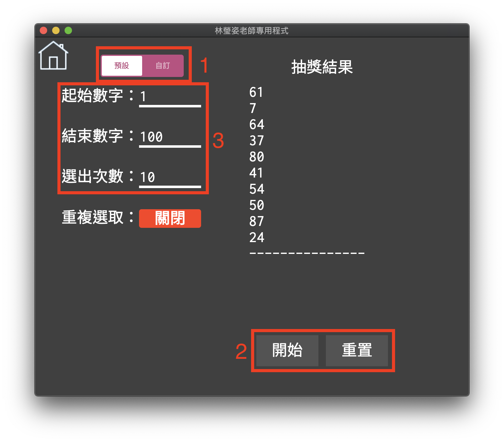

# Lottery


This application is built for my senior high school's musical teacher, because the applications and webpages she used in lession **suck**.  

This application included two functions:

1. Scoreboard
2. Lottery

Also, there's an English version too. Just overwrite `index.html` with `index.html.en`.

## Getting Started

These instructions will get you a copy of the project up and running on your local machine for development and testing purposes. See deployment for notes on how to run the project.  

### Requirements

* Node.JS
* NPM package manager

### Installation

Download packed application from [release page](https://github.com/samuel21119/Lottery/releases).

## Running the tests

```shell
$ npm install
$ npm start
```

## Building

```shell
$ npm install
$ npm run dist
```


## Usage

### Scoreboard



1. Add new group.
2. Group name. You can change it by using your mouse and keyboard!
3. Buttons to change score.
4. Displays score. You can also change it by using your mouse and keyboard!
5. Remove this group.

### Lottery



1. Change lottery mode.
2. Start / Clear result.
3. Start number & End number & Select times.

## Built With

* [Electron](https://electronjs.org/) - Framwork for cross platform desktop apps.
* [Electron-builder](https://github.com/electron-userland/electron-builder) - Pack electron project to excutable app.

## Author

* [Samuel Huang (黃恩明)](https://samuel.nctu.me)

## License

This project is licensed under the MIT License - see the [LICENSE.md](LICENSE.md) file for details